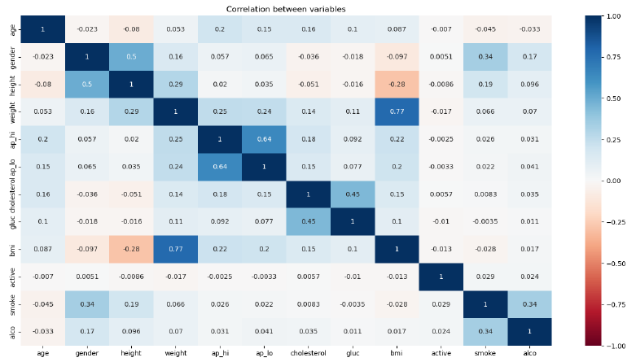
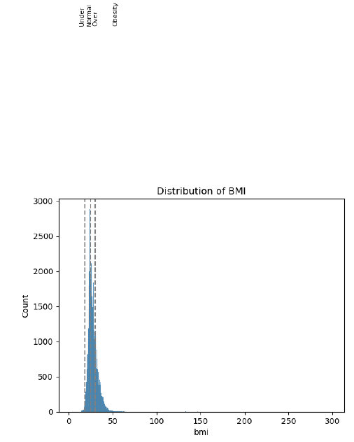
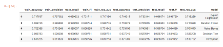

### Predictive Analysis of Chronic Diseases based on Dietary Habits Identification using Machine Learning Techniques

**Description:** This project focuses on machine learning techniques to predict the likelihood of individuals developing chronic diseases, specifically Obesity, Cardiovascular disease-Cholesterol, and Diabetes. It emphasizes the significant impact of unhealthy dietary habits and a sedentary lifestyle on health, underlining the importance of proactive lifestyle changes.

**What it does:** The project uses over 10,000 rows of datasets related to chronic diseases, encompassing various attributes such as smoking, blood pressure, weight, and age. Machine learning models, including Logistic Regression and Gaussian Naive Bayes, are applied to analyze these datasets and predict the probability of individuals developing chronic diseases. The goal is to provide insights that can encourage healthier lifestyles and early interventions to prevent the onset of chronic diseases.

**Technologies Used:** 
Machine Learning: Various machine learning algorithms, including Logistic Regression and Gaussian Naive Bayes, are used for predictive analysis.
Python: Jupyter Notebook is employed for data preprocessing, analysis, and model training.
Data Visualization: Correlation heat maps and distribution plots are used to visualize data relationships.
Data Preprocessing: Data cleaning techniques are applied to remove duplicates and prepare datasets for analysis.

### Output
*Correlation heat map*

*Distribution plot*

*Result*

**Conclusion:** This project emphasizes the significant role of a healthy lifestyle and balanced diet in preventing chronic diseases. By analyzing lifestyle patterns and dietary habits, the study successfully predicts the probability of individuals developing Obesity, Cardiovascular Disease (Cholesterol), and Diabetes. The results underscore the importance of physical activity and dietary choices in reducing the risk of chronic diseases, highlighting the potential for early intervention and prevention. As per the results we understand that Logestic Regression gives better overall results as compared to all other machine learning algorithms.

